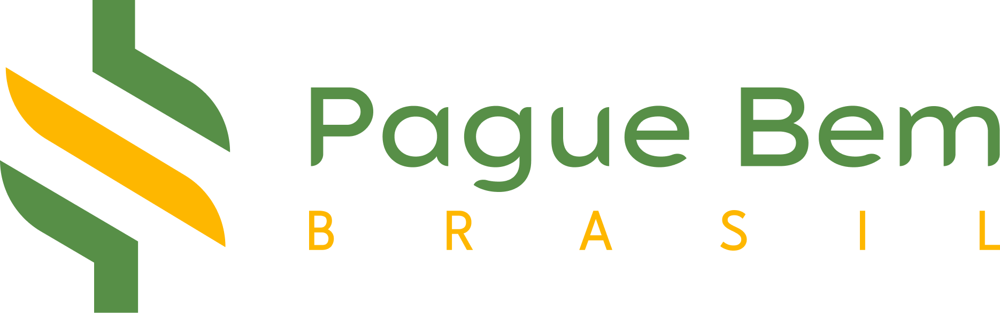

 
 

# RiseUp 2024.2 - Pague Bem

O principal objetivo deste projeto é criar um novo site para a Pague Bem Brasil que destaque a sua posição como líder no mercado de soluções financeiras digitais, além de melhorar a experiência do usuário, aumentar a conversão de leads e fortalecer a marca. 

O novo site deve ser moderno, intuitivo e otimizado para atender às necessidades do nosso público-alvo, garantindo que nossos serviços sejam facilmente acessíveis e compreensíveis.

## Tech Stack

**Front-end:** Next.js, Tailwind CSS e Jest
 

 

**Next.js:** além de ser um framework React com grande utilização no mercado e ter uma comunidade grande de desenvolvedores como apoio, essa tecnologia oferece: 
- static site generation (SSG)
- server-side rendering (SSR)
- otimização de performance
- rotas automáticas
- seo-friendly

**Tailwind CSS:** é um framework para facilitar e agilizar o desenvolvimento CSS, sendo facilmente implementado em tecnologias web, têm como pontos fortes: 
- css utility-first framework
- customização extrema, usando design system
- responsividade fácil

**Jest:** dada a importância de implementar testes unitários em um projeto, a escolha do Jest foi devido a: 
- configuração mínima e depuração fácil
- grande ecossistema e comunidade
- integração facilitada com ci/cd e melhores tecnologias do mercado

