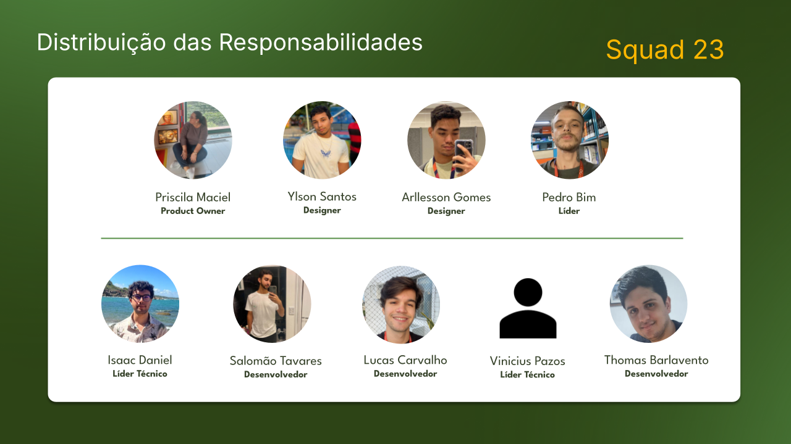

 
 

# RiseUp 2024.2 - Pague Bem

**Problema:** O site da PBB não comunica a liderança no mercado de
soluções digitais. O design é desatualizado, a navegação é
complexa, faltam funcionalidades, e a responsividade e
integração são insuficientes, limitando o seu engajamento e
a geração de leads.

**Solução:** Redesign do site alinhado à nova marca, com foco na experiência
intuitiva e funcional. O projeto inclui otimização de formulários,
integração com CRM e Google Analytics, além de total responsividade,
destacando a inovação e credibilidade da PBB.

---

#### Persona 1: Mariana Santos  
**Idade:** 45 anos  
**Cargo:** Gerente Financeira  
**Empresa:** Clínica de Saúde (Médio Porte)  
**Formação Acadêmica:** Graduada em Contabilidade com pós em Finanças e
Controladoria

#### Problema:

Precisa automatizar o processo de cobrança e monitorar o fluxo de
recebíveis da clínica. Ela procura uma plataforma integrada para gerir boletos/pix
e manter o controle das negociações de pagamentos com clientes inadimplentes,
além de relatórios detalhados para análises financeiras. Ela está buscando qual a
melhor plataforma que supre as necessidades dela e que demonstre isso de forma
fácil e prática.

#### Site:

Diferenças em comparação a outras soluções, destaque para facilidade na
utilização da plataforma e emissão de relatórios gerenciais.

---

#### Persona 2: William Alves 
**Idade:** 35 anos  
**Cargo:** Proprietário  
**Empresa:** Loja de Artigos Esportivos (Pequeno Porte)  
**Formação Acadêmica:** Ensino Médio Completo

#### Problema:

Procura uma solução prática para gerenciar as cobranças dos clientes da sua loja, que trabalha com vendas parceladas. Ele quer otimizar o processo de envio de carnês digitais, reduzindo o tempo gasto com cobranças manuais a fim de melhorar o seu fluxo de caixa. É preciso que a solução seja acessível, fácil de manusear e amigável para os clientes.

#### Site:

Informações sobre os valores dos planos, diferentes formas de contato com o cliente e credibilidade de outras empresas que tenham aderido à solução.

---

#### Persona 3: Eduardo Lima  
**Idade:** 50 anos  
**Cargo:** Diretor de TI 
**Empresa:** Construtora (Grande Porte)  
**Formação Acadêmica:** Graduado em Ciência da Computação com Especialização
em Segurança da Informação

#### Problema:

Procura uma solução prática para gerenciar as cobranças dos clientes da sua loja, que trabalha com vendas parceladas. Ele quer otimizar o processo de envio de carnês digitais, reduzindo o tempo gasto com cobranças manuais a fim de melhorar o seu fluxo de caixa. É preciso que a solução seja acessível, fácil de manusear e amigável para os clientes.

#### Site:

Destaque para integração com as APIs da PBB e FAQ (incluindo dúvidas sobre
a implantação).

---

#### Persona 4: Ana Souza  
**Idade:** 28 anos  
**Cargo:** Analista de Cobrança  
**Empresa:** Universidade Particular (Grande Porte)  
**Formação Acadêmica:** Graduanda em Administração de Empresas

#### Problema:

Deseja simplificar o seu trabalho, a partir da adoção de uma solução
que automatize o envio de boletos para os alunos matriculados nos cursos da
instituição. Ela procura uma plataforma que ofereça a emissão recorrente de
cobranças e que ajude a manter os clientes informados por meio de notificações
via e-mail, SMS e voz. Para clientes inadimplentes, é importante que seja também
ofertado a possibilidade de pagamento dos débitos por cartão de crédito.

#### Site:

Destaque para variadas formas de recebimento dos débitos, benefícios ao
aderir a uma plataforma de cobrança digital e blog para saber de outros temas
relevantes do momento.

**Análise do site atual:**

---

• Destaque para clientes: Credibilidade das marcas e
valorização da opinião dos usuários;  
• Chamadas para ação: Incentivo em todo o site para
que o usuário crie uma conta ou fale com o consultor;  
• Informações detalhadas sobre serviços e planos:
Facilitam a compreensão do possível cliente;  
• Destaque para diversidade de produtos: Atender as
possíveis necessidades dos clientes.  

--- 

• Design desatualizado: Interface que não reflete a
posição de liderança da empresa;  
• Navegação complexa e muitos textos: Acesso
dificultado às informações;  
• Falta de funcionalidades: Ausência de ferramentas
para capturar leads e integração com sistemas de
análise;  
• Baixa responsividade: Problemas de adaptação em
diferentes dispositivos.  

--- 

• Segmentação: Deixar informações principais na home
do site, e o detalhamento em seções específicas;  
• Site visual: Reduzir mais os textos e inserir mais
imagens chamativas, inclusive da própria plataforma;  
• FAQ: Implementação de seção dedicada as dúvidas
comuns;  
• Blog: Implantação para aumentar a autoridade da
marca e interação com possíveis clientes;  
• Redes sociais: Destaque maior para essa integração.  

---

• Concorrência agressiva: Competidores estão
constantemente inovando;  
• Mudanças nos algoritmos de buscas: Alterações
podem impactar o posicionamento orgânico do site;  
• LGPD: Regulamentações mais rígidas podem exigir
mudanças na estrutura do site e nas práticas de coleta
de dados, afetando a operação;  
• Tecnologias em rápida evolução: Se não houver
atualização pode tornar o site ultrapassado.

---

**Jornada do usuário:**

|                       | **Atração**                                        | **Interação**                                      | **Engajamento**                                  | **Conversão**                                    |
|-----------------------|----------------------------------------------------|---------------------------------------------------|--------------------------------------------------|-------------------------------------------------|
| **Objetivos**          | Redes sociais, site e networking                   | Procurar detalhes no site                         | Aderir aos pacotes mais acessíveis               | Contratação de pacotes mais completos e personalizáveis |
| **Necessidades**       | Soluções tecnológicas para cobrança                | Disposição ao serviço                             | Garantia                                         | Satisfação                                       |
| **Sentimentos**        | Mudança                                            | Disposto, aberto                                  | Interessado                                      | Convencido                                       |
| **Barreiras**          | Forte concorrência                                 | Hesitação, estilo tradicional de gestão           | Preço e facilidade de contratação                | Disposição, compromisso                          |

---

**Necessidades do novo site:**

• Linguagem simples, direta e organizada: Facilita
a comunicação;  
• Design moderno e atraente: Visualmente
agradável;  
• Depoimentos de Clientes: Com carrossel de
imagens e informações;  
• Recursos interativos: Aumentam a interação do
usuário;  
• Menu detalhado: Facilita a navegação;  
• Área de notícias e dicas: Oferece valor adicional
aos visitantes;  
• Imagens, vídeos, parallax e animações:
Enriquecem a experiência do usuário.

---

**Distribuição das responsabilidades:**

